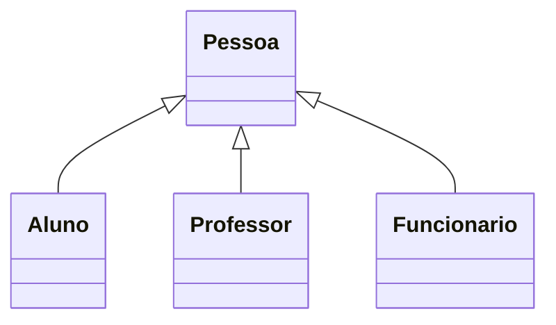

# 🎓 Campus Inheritance

A small object-oriented Python project that models the people of a school or university using **class inheritance**.

## About

A base class holds the data and behavior shared by everyone (name, age, birthday). Three child classes extend it, each adding its own attributes, its own action and a custom `__str__`.

| Class | English meaning | Extra attributes | Own action |
|---|---|---|---|
| `Pessoa` | Person (base class) | `nome`, `idade` | `fazer_aniversario()` – birthday, age +1 |
| `Aluno` | Student | `curso`, `turma` | `fazer_matricula()` – enrolls |
| `Professor` | Teacher | `especialidade`, `nivel` | `dar_aula()` – starts a class |
| `Funcionario` | Staff member | `cargo`, `setor` | `bater_ponto()` – clocks in |



## Concepts practiced

- Inheritance and `super().__init__()`
- Reusing behavior from a parent class
- `__str__` for readable object output
- Splitting code into modules and importing between them

## Project structure

```
campus-inheritance/
├── __main__.py      # creates one object of each type and runs their methods
├── pessoa.py        # base class
├── aluno.py
├── professor.py
└── funcionario.py
```

## Requirements

- Python 3.8+
- No external dependencies

## How to run

```bash
git clone https://github.com/<your-user>/campus-inheritance.git
cd campus-inheritance
python __main__.py
```

## Example output

```
Manuel acabou de fazer matricula
Aluno Manuel, tem 10 anos, e está na turma 12 do curso ADS
Prof.Samuel começou a dar aula
Prof.Samuel, tem 38 anos, tem o cargo de professor de Biologia com Mestrado
Cláudia acabou de bater ponto
O(A) funcionário(A) Cláudia, tem 28 anos, trabalha de Secretária no setor do(a) Secretaria
```

Notice that every person had a birthday before being printed, so each age is one year higher than the value passed to the constructor.

## Ideas for improvement

- Add a `__str__` to the base class `Pessoa`
- Show polymorphism by keeping all people in one list and looping over it
- Add type hints and a few unit tests
- Validate input (for example, no negative ages)
